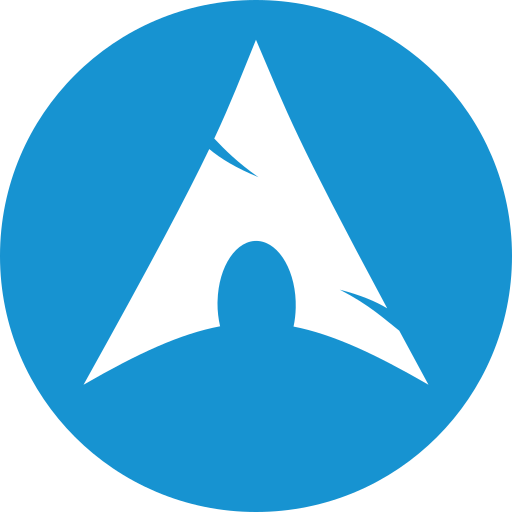

### About Me:
I am a cybersecurity and IT professional in training with hands-on experience in digital forensics, penetration testing, and secure systems management. Currently pursuing a B.S. in Computer Science with a focus on Cybersecurity at Colorado Technical University, I’ve gained practical skills through platforms such as TDX Arena, TryHackMe, Hack The Box, PicoCTF, and the National Cyber League.

I’ve built and led a cybersecurity learning community of 100+ members, supported penetration testers on IoT CTF challenges, and developed digital solutions for businesses in healthcare and quality management. My interests span network security, ethical hacking, open-source intelligence, and cloud technologies.

Alongside my technical journey, I hold a patent, am CompTIA Security+ certified, and expect ISO 27001 certification in 2025. I thrive at the intersection of problem-solving, technology, and teamwork, with experience ranging from teaching assistant roles at Marquette University to leading youth sports programs.

I’m eager to contribute my skills in cybersecurity, DevOps, and IT infrastructure to innovative teams and projects that drive secure digital transformation.

### Operating Systems
#| Arch-Linux | Windows-11 | Ubuntu | Parrot-Security | Proxmox |
#|---|---|---|---|---|
|  |  |  |  |  | 

### Social Media:
| [LinkedIn](https://www.linkedin.com/in/vikrammalkan/) | [GitHub](https://github.com/JackJohnsonGitHub) | [Discord](https://discord.gg/kRAKakXd) | [Website](https://example.com) |
|---|---|---|---|
|  |  |  |  |

 

